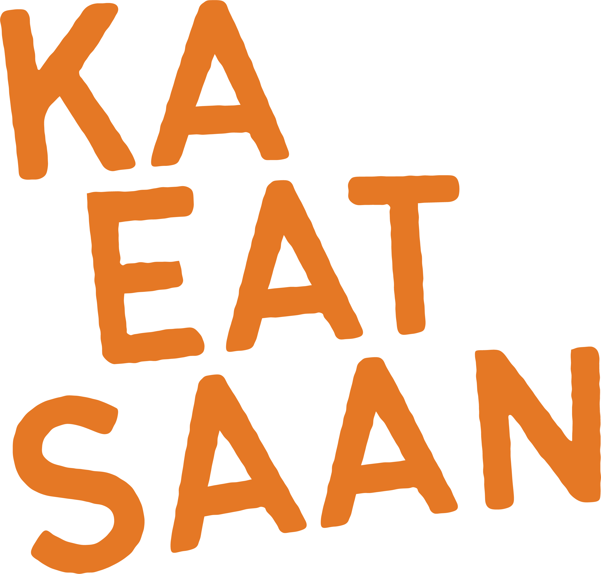

<p align="center">
  
</p>

<h3 align="center">KaEatSaan - Where to Eat? 🍜</h3>
<p align="center">Saan tayo kakain? No more "Bahala na si Batman"! Let KaEatSaan decide for you!</p>

<div align="center">

[](https://github.com/hmcldryl/KaEatSaan/)
[](https://github.com/hmcldryl/KaEatSaan/)
[](https://github.com/hmcldryl/KaEatSaan/)
[](https://opensource.org/licenses/MIT)
[](https://kaeatsaan.com/)
  


</div>

## About 🤔

KaEatSaan (a play on "Kahit Saan" or "Anywhere") is your trusty sidekick for those moments when you and your friends can't decide where to eat. Say goodbye to the endless "Kayo bahala" loop! Spin the wheel, land on a kainan, done.

## Features ✨

- **Roulette wheel:** drag or tap to spin through your filtered food spots, weighted fairly, no sign-in required
- **Filters:** budget (₱ to ₱₱₱₱₱), distance, cuisine, classification, open/closed, new places
- **Kainan List:** drag-reorder or hide specific outlets from the wheel without changing your filters
- **Favorites & History:** save go-to spots and look back at past spins
- **XP & levels:** earn XP and build a streak for spinning and checking out outlets
- **Community outlet data:** signed-in users can add kainans and reviews, backed by Firebase Realtime Database

## Tech Stack 💻

- **Framework:** [Next.js](https://nextjs.org/) (App Router, static export) + React 19 + TypeScript
- **Hosting & DB:** [Firebase](https://firebase.google.com/) (Auth + Realtime Database + Hosting)
- **Styling:** [Tailwind CSS v4](https://tailwindcss.com/) & [Material UI v7](https://mui.com/)
- **State Management:** [Zustand](https://zustand-demo.pmnd.rs/)
- **Animations:** [Framer Motion](https://www.framer.com/motion/) + HTML Canvas (wheel)
- **Maps:** [Leaflet](https://leafletjs.com/) + react-leaflet

## Getting Started 🚀

1. Clone the repo
2. Install dependencies: `npm install`
3. Copy `.env.local` and fill in your Firebase config (`NEXT_PUBLIC_FIREBASE_*` vars)
4. Run the dev server: `npm run dev`

Other commands:

```bash
npm run build   # Production build (static export to /out)
npm run lint    # ESLint v9
```

## Testing 🧪

Do we have unit tests? Nope. I just test whatever locally before pushing. It is what it is.

## Contributing 🤝

I'm not strict about contributions, but if you want to help, check out the `CONTRIBUTING.md` file for some loose guidelines. There are also simple PR templates to keep things a bit organized, but no pressure to follow them religiously.

## Community 👨‍👩‍👧‍👦

Join our Discord server to hang out, ask questions, or just share your favorite food spots:

[](https://discord.gg/e3b9rtYUx5)

## Contributors 🍜
[](https://github.com/hmcldryl/KaEatSaan)
